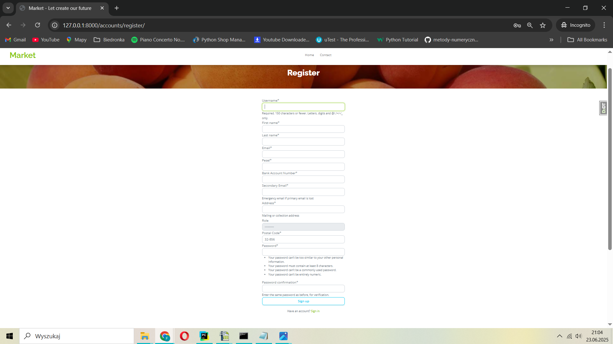
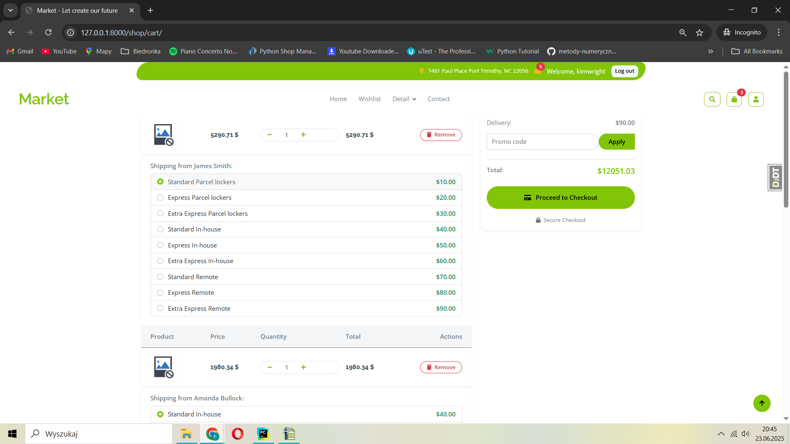
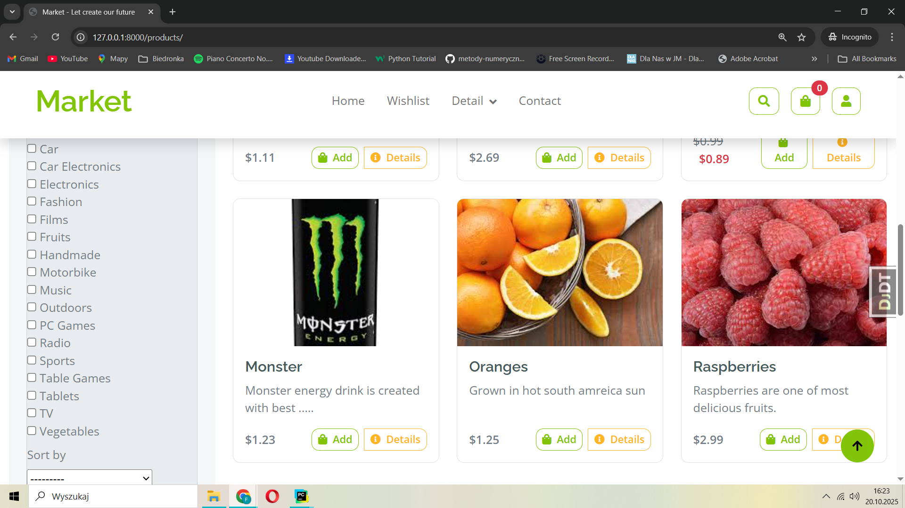
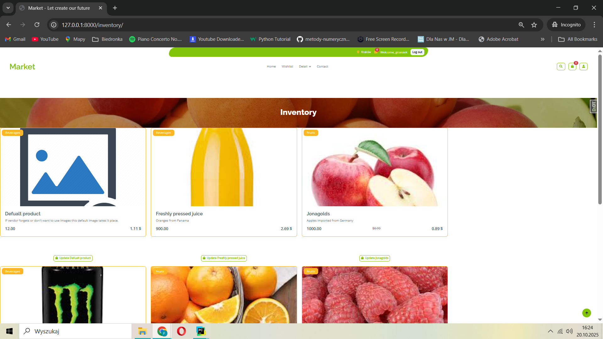
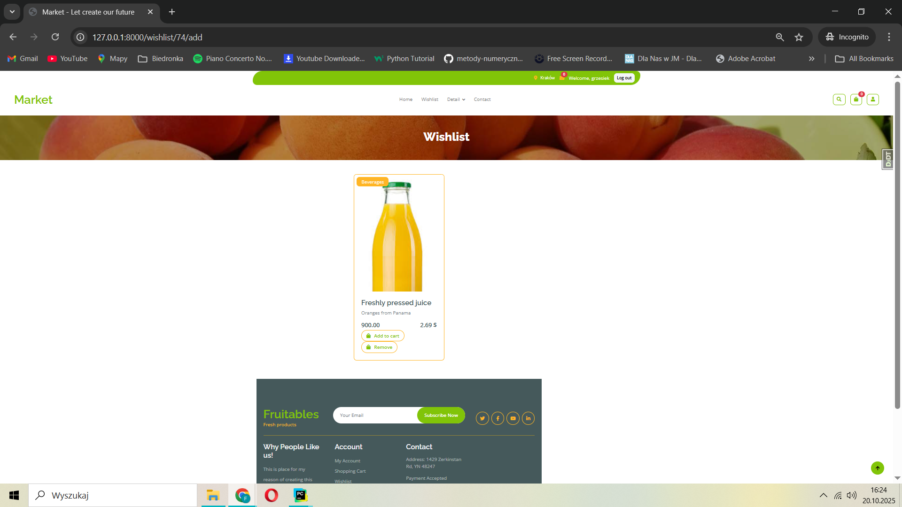
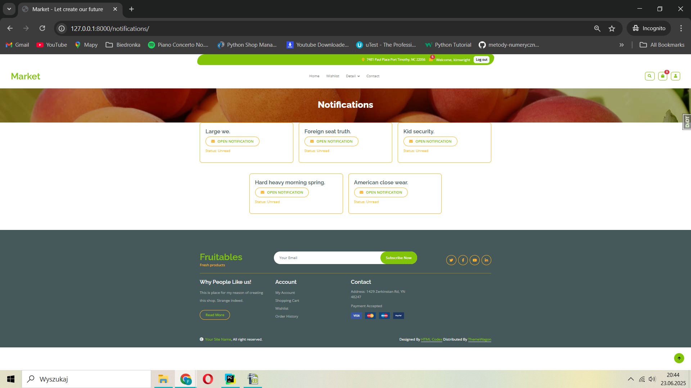
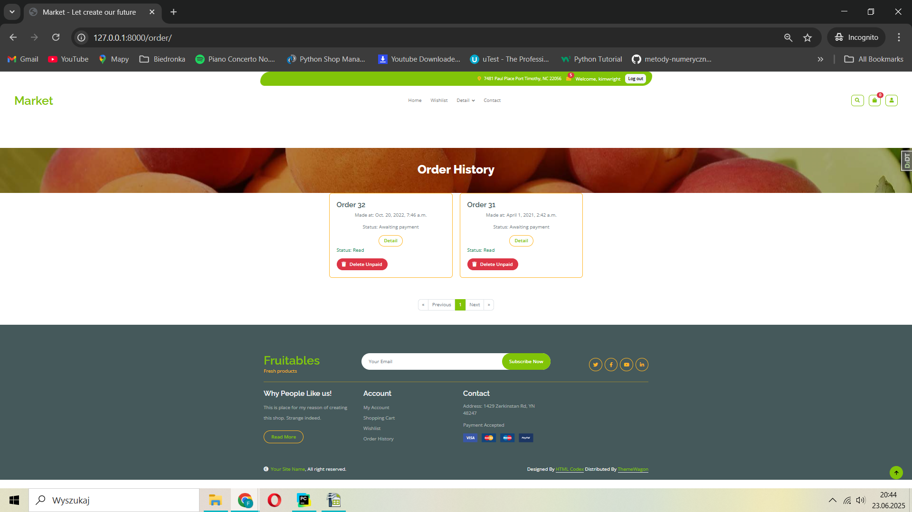
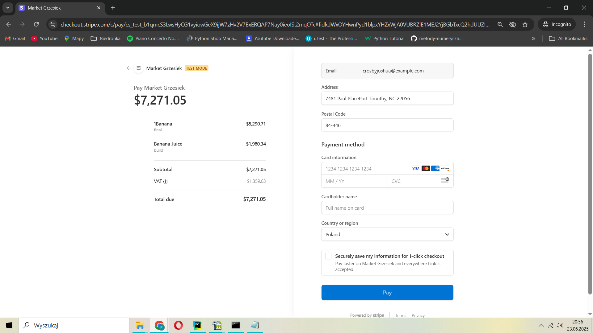

# Market - Multi-Vendor Marketplace Platform
# Content of Project
* [General info](#general-info)
* [Technologies](#technologies)
* [Setup](#setup)
* [More detailed information about modules](#more-detailed-information-about-modules)
* [Application view](#application-view)


## General info
<details>
<summary>Click here to see general information about <b>Market</b>!</summary>
<b>Project</b>
Market is an e-commerce marketplace platform that allows multiple vendors to offer their products in one place. Our platform stands out with its flexible system for selling products in various units of measurement (pieces, grams, kilograms, and liters), making it ideal for sellers offering both packaged goods and products sold by weight.
We can create two types of users: customers and vendors, each with different permissions and capabilities. The third type is the admin.

## Main Features
* Multi-Vendor Management - each vendor has access to their own administrative panel
* Intuitive User Interface for both customers and vendors
* Advanced Product Filtering and Search
* Flexible Sales Units - ability to offer products in pieces, grams, kilograms, and liters.
* Session-Based Shopping Cart - shopping cart functionality that persists during user sessions
* Wishlist Functionality - users can mark products and add them to their wishlist to receive notifications when items go on sale
* Order Tracking and Purchase History - users can check their previous orders and easily reorder items
* Stripe Online payment system supporting multiple payment methods
* Reviews and Ratings System for products and vendors

# Advanced Product Management:

  * Creating and modifying products according to vendors needs
  * Adding multiple images to each product
  * Promotion and discount system

</details>

### Main languages & tools
<ul>
<li> Programming language: Python : 3.13</li>
<li> Framework: Django </li>
<li> Database: PostgreSQL </li>
<li> Payments: Stripe</li>
<li> Requirements & Virtual environments: Poetry </li>
<li> Containerization: Docker & Docker Compose</li>
</ul>

### Secondary packages & tools
<uL>
<li> crispy-forms: ...</li>

</ul>

### Setup - How to run project
1) Download the project using the git `clone` command
    ```bash
    git clone https://github.com/GrzesiekKRK/Market.git
    ```
2) Create virtual environment using command below:
    ```bash
    python -m venv .venv
    ```
3) Activate environment using command:
    Windows:
   ```
   ./.venv/Scripts/activate
   ```
    Linux / OSX
    ```
    source ./.venv/lib/activate
    ```
4) If you are in venv install all required dependencies using command:
    ```
   pip install -r requirements.txt
   ```
5) In the main directory where `manage.py` is located run
    ```
      python manage.py runserver
    ```
6)  Application will be available at `localhost:8000`


### Setup - How to run Project using Docker
1) Download the project using the git `clone` command
    ```bash
    git clone https://github.com/GrzesiekKRK/Market.git
    ```
2)  Navigate to the project directory
    ```bash
    cd Market
    ```
3) Run the container using docker-compose:
   ```bash
   docker-compose up --build -d
   ```
4) Application will be available at `localhost:8000`


## More detailed information about modules
<details>
<summary>Click here to see information about modules <b>Project</b>!</summary>
<b>Modules</b>

* Users -
    Customer:
    The most limited user role. Customers upon account creation create a shopping cart. Can add products to it, and complete their purchase using Stripe for payment.

    Vendor:
    Vendors can add products along with images through forms, and set product details such as price and quantity. Each vendor has their own inventory system to manage all of their products created upon account creation.
  
* Cart -
    A Session-Based Cart is used to temporarily store a customer’s cart data on the server side, associated with their session. This allows users to add products to their cart and continue shopping.
    Key Features:
        Cart data is saved in the session (request.session), not in the database.
        Each cart contains product IDs, quantities, and optionally prices (though prices should be verified at checkout).
        Cart is cleared after successful checkout or when the session expires.
        
* Products -
    A Django model used to represent products in the system. Products are created by vendors through a form. Each product contains key information required for listing and selling.
        Vendors use a form to create and update products.
        Products are displayed in the shop and can be added to a customer's cart.
        Each product belongs to a specific vendor and can be managed via the vendor’s inventory dashboard.
        Each product is uniquely identified using an auto-generated ID (id field in the Django model), which ensures proper tracking and management, even if multiple products have the same name or attributes
    Key Features:
        Allows duplicats (same name, price etc)
        Multi-Images
        Regular and sale price
 
* Inventories -
    Responsible for storing and managing the products added by each vendor (owner). It acts as a personal product collection for each vendor, allowing them to view, update, or remove items they have listed.
    Key Features:
        Each vendor has their own inventory.
        Only the owner (vendor) can access and manage their inventory.
        Products in the inventory can be edited (e.g. price, quantity) or deleted.

* Wishlists -
    Allows customers to save products they’re interested in for later, without adding them directly to the cart. This improves user experience by helping them keep track of favorites or products they may want to purchase in the future
    Key Features:
        Send notifications when product is on sale.

* Notifications -
    System is responsible for dispatching alerts to users when specific events occur. It helps keep users informed and engaged by providing real-time or near-real-time updates on important actions or changes related to their account or activity.
    Key Events That Trigger Notifications:
        Order Creation – Notifies the customer (and optionally the vendor) when an order has been successfully placed.
        Payment Confirmation – Alerts the customer when a payment is completed via Stripe.
        Wishlist Product on Sale – Notifies the user if a product in their wishlist has a price drop or discount.
    Key Features:
        Supports in-app notifications (e.g. notification bell), and optionally email or push notifications.
        Can be extended to support additional event types (e.g. out-of-stock alerts, order shipped, etc.)
        Notifications can be marked as read/unread.
        Users can view a list of recent notifications from their dashboard or profile.* Menu - Takes all input and shows menu.

* Orders -
    System is responsible for recording purchased items along with their price at the moment of purchase. It ensures that each transaction is saved accurately for reference, tracking, and future actions.

    Key Features:
        Saves a snapshot of purchased products, including quantity and price at the time of purchase (even if the product price changes later).
        Stores all relevant order details: customer, products, total amount, payment status, and timestamp.
        Allows customers to reorder past purchases with a single click (e.g. “Renew Order” button).
        Can be extended to support order status tracking (e.g. pending, shipped, delivered).
 
  * Payments - Stripe
      Stripe Checkout is a pre-built, hosted payment page provided by Stripe that makes it easy to accept payments online. It securely handles customer payment details, reducing the complexity of dealing with sensitive information directly.
      Key Features:
          Simple Integration: Stripe Checkout is designed to be easy to integrate with minimal code, using Stripe's pre-built UI for the payment page.
          Secure Payments: Payments are processed using Stripe's secure infrastructure, ensuring PCI-DSS compliance.
          Supports Multiple Payment Methods: Credit cards, debit cards, Apple Pay, Google Pay, and other local payment methods depending on your region.
          Redirect After Payment: After the payment is completed, users are redirected back to your site (e.g., an order confirmation page).

    * Deliveries -The delivery system manages shipping methods and logistics for the multi-vendor marketplace. It handles delivery options, pricing calculations, and automatically filters available shipping methods based on product dimensions and vendor requirements.

    Key Features:
        Smart Delivery Filtering: Automatically determines which delivery methods are available based on product dimensions (length, width, height, weight).
        Multi-Vendor Support: Groups products by vendor and calculates separate delivery costs for each vendor's items.
        Dimensional Constraints: Each delivery method has specific size and weight limits (e.g., parcel lockers have stricter limits than standard delivery).
        Flexible Pricing: Each delivery method has its own pricing structure and estimated delivery time.
        Parcel Locker Integration: Special handling for parcel locker deliveries with size restrictions (max 90×40×20 cm, 25kg).
        The system automatically excludes incompatible delivery methods (like parcel lockers for oversized items) and provides fallback options to ensure customers always have available shipping choices.

</details>


